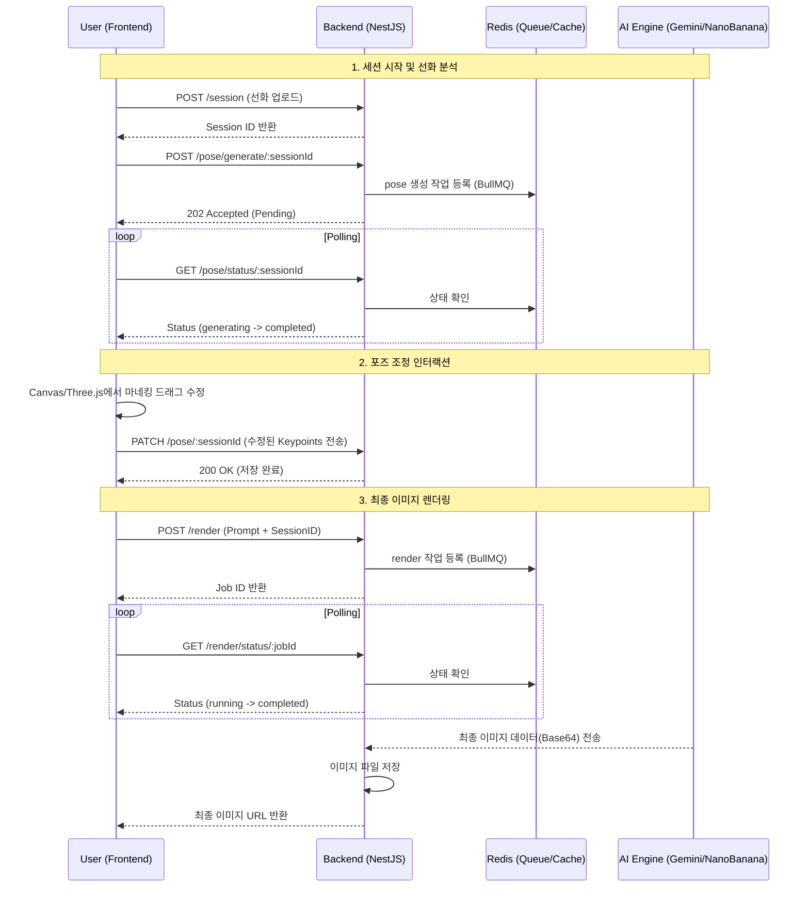

# 🎨 Deluxine AI Pipeline: Full Specification & Integration Guide

본 문서는 **Deluxine** 서비스의 핵심 파이프라인인 '선화 기반 포즈 제어 및 고품질 이미지 생성' 시스템을 프론트엔드에서 연동하기 위한 종합 가이드입니다.

---

## 1. 유저 경험 여정 (User Journey)

유저는 다음과 같은 단계를 통해 최종 결과물을 얻습니다.

1.  **시작:** 유저가 자신이 그린 **선화(Line Art)** 이미지를 업로드합니다.
2.  **분석 (AI):** 시스템이 선화를 분석하여 캐릭터의 포즈를 자동으로 인식하고, 관절 좌표(Keypoints)를 생성합니다.
3.  **조정 (Interaction):** 유저는 화면에 나타난 3D/2D 마네킹의 관절을 드래그하여 원하는 구도로 자유롭게 수정합니다.
4.  **연출:** 배경, 조명, 스타일 등에 대한 요구사항을 **자연어 프롬프트**로 입력합니다.
5.  **생성 (AI):** 수정된 포즈 + 원본 선화 + 프롬프트를 결합하여 Nano Banana(Gemini Pro) AI가 최종 채색 일러스트를 생성합니다.
6.  **완료:** 생성된 이미지를 확인하고, 필요 시 포즈나 프롬프트를 수정하여 다시 생성(Iterate)합니다.

---

## 2. 시스템 시퀀스 다이어그램 (Workflow)



---

## 3. 상세 API 명세

### 3.1 세션 및 데이터 관리

#### [POST] `/session` - 세션 생성
- **기능:** 유저의 작업 공간(Session)을 생성하고 선화 경로를 지정합니다.
- **Request:** `{ "lineArtUrl": "string" }`
- **Internal:** DB에 `Session` 엔티티를 생성하고 `history`에 'session.created' 기록.

#### [POST] `/pose/generate/:sessionId` - 자동 포즈 인식
- **기능:** 업로드된 선화에서 캐릭터의 구조를 추출합니다.
- **작동 방식:** 비동기 작업으로 전환되며, 내부적으로 `GeneratePoseService`가 작동하여 머리, 어깨, 팔꿈치 등 주요 관절 위치를 찾습니다.

---

### 3.2 포즈 인터랙션 (핵심)

#### [GET] `/pose/status/:sessionId` - 상태 및 데이터 조회
- **Response:**
  - `generating`: AI 분석 중
  - `completed`: 분석 완료. 아래와 같은 포즈 데이터가 포함됨:
    ```json
    {
      "status": "completed",
      "pose": {
        "id": "...",
        "keypoints": [
          { "name": "head", "x": 0.5, "y": 0.1 },
          { "name": "right_hand", "x": 0.8, "y": 0.4 }
        ]
      }
    }
    ```

#### [PATCH] `/pose/:sessionId` - 포즈 수정 사항 반영
- **기능:** 유저가 마네킹을 움직일 때마다 서버에 실시간(또는 최종) 저장합니다.
- **중요:** 이 데이터는 나중에 Nano Banana AI에 그대로 전달되어 캐릭터의 뼈대가 됩니다.

---

### 3.3 렌더링 및 결과

#### [POST] `/render` - 최종 이미지 생성 요청
- **Request:**
  ```json
  {
    "sessionId": "uuid",
    "prompt": "해 질 녘의 루프탑, 시네마틱 조명, 고퀄리티 애니메이션 스타일"
  }
  ```
- **기능:** `Session`의 선화 + `Pose`의 관절 정보 + `Prompt`를 결합하여 AI 호출.
- **Constraint:** 프롬프트는 배경과 연출에만 집중해야 하며, 캐릭터의 자세는 이미 포즈 데이터로 고정되어 있습니다.

#### [GET] `/render/status/:jobId` - 최종 결과 확인
- **Response (Completed):**
  ```json
  {
    "status": "completed",
    "output_image": "/uploads/render-final-xxxx.png",
    "generation_time": "2026-03-09T..."
  }
  ```

---

## 4. 프론트엔드 구현 팁

### 4.1 포즈 조정 UI (Canvas/Three.js)
- 서버에서 제공하는 `keypoints`의 x, y 좌표는 일반적으로 **정규화(0~1)**된 값입니다. 
- 캔버스 크기에 맞춰 `x * width`, `y * height`로 변환하여 점(Joint)을 그리세요.
- 점들 사이를 연결하는 선(Skeleton)을 그려 유저가 인체 구조를 쉽게 파악하게 하세요.

### 4.2 실시간성 관리
- 포즈 수정(`PATCH`)은 유저가 드래그를 멈췄을 때(Debounce) 호출하는 것이 효율적입니다.
- 폴링 주기는 포즈 생성 시 2초, 렌더링 시 3~5초를 권장합니다.

---

## 5. 비상 대응 및 에러 코드
- `failed`: AI 엔진 응답 지연 또는 이미지 해석 불가. 유저에게 다른 선화 업로드를 권장하세요.
- `pending`: 서버 부하로 인해 작업 대기 중. 조금 더 기다려 달라는 UI 처리가 필요합니다.

---
**Technical Note:** 본 시스템은 Redis를 백엔드 상태 저장소로 활용하여 서버 재시작 시에도 유저의 렌더링 작업이 중단되지 않도록 설계되었습니다.
