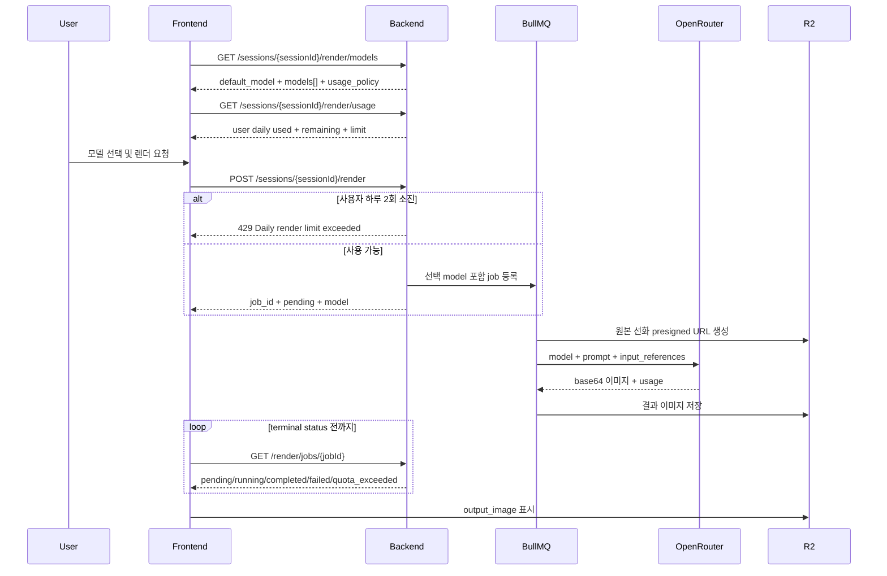

# 프론트엔드 렌더 모델 셀렉터 연동 가이드

작성일: 2026-07-10  
대상: Deluxine Frontend  
백엔드 기준: OpenRouter 이미지 생성 모델 선택 기능 적용 버전

## 1. 문서 목적

기존 백엔드는 Gemini 이미지 모델 하나만 사용했습니다. 현재는 Gemini 의존성을 제거하고, 사용자가 렌더링 모델을 직접 선택할 수 있도록 OpenRouter 기반의 다중 모델 구조로 변경되었습니다.

프론트엔드는 다음 작업이 필요합니다.

1. 백엔드에서 사용 가능한 모델 목록을 조회합니다.
2. 모델 셀렉터를 표시합니다.
3. 사용자가 선택한 모델 ID를 렌더 생성 요청의 `model` 필드로 전달합니다.
4. 기존과 동일하게 렌더 작업 상태를 polling합니다.
5. `quota_exceeded` 등 모델별 실패 상태를 사용자에게 적절히 안내합니다.

OpenRouter API 키는 백엔드 전용입니다. 프론트엔드 코드, 환경변수, 네트워크 요청에 OpenRouter API 키를 포함하면 안 됩니다.

---

## 2. 주요 변경사항

### 변경 전

- 렌더링 모델이 Gemini로 고정되어 있었습니다.
- 프론트엔드에서 모델을 선택하거나 전달할 수 없었습니다.
- Gemini quota가 소진되면 전체 이미지 생성 기능이 영향을 받았습니다.

### 변경 후

- 렌더 생성 요청에 선택적 `model` 필드가 추가되었습니다.
- 모델 목록 조회 API가 추가되었습니다.
- 모델을 생략하면 `FLUX.2 Pro`가 기본값으로 사용됩니다.
- 세 모델 모두 OpenRouter 종량제로 호출하는 이미지 생성 및 편집 모델입니다.
- 모델 목록 응답에서 사용자별 하루 2회 정책을 제공합니다.
- 선택 모델은 BullMQ 작업과 DB metadata에 저장됩니다.
- 렌더 완료 후 상태 응답에서 실제 사용 모델을 확인할 수 있습니다.
- OpenRouter의 `402` 또는 `429` 오류는 `quota_exceeded` 상태로 정규화됩니다.

---

## 3. 지원 모델

현재 백엔드에서 허용하는 모델은 정확히 아래 세 개입니다.

| 용도        | 표시 이름          | API에 전달할 ID                | 설명                                            |
| ----------- | ------------------ | ------------------------------ | ----------------------------------------------- |
| 가성비      | Seedream 4.5       | `bytedance-seed/seedream-4.5`  | 장당 약 $0.04의 비용 효율적인 이미지 편집 모델  |
| 기본/균형형 | FLUX.2 Pro         | `black-forest-labs/flux.2-pro` | 품질, 속도, 참조 이미지 편집의 균형이 좋은 모델 |
| 고급        | Riverflow V2.5 Pro | `sourceful/riverflow-v2.5-pro` | 복잡한 다단계 편집을 위한 고품질 모델           |

주의사항:

- API에는 표시 이름이 아니라 정확한 모델 ID를 전달해야 합니다.
- 임의의 OpenRouter 모델 ID는 허용되지 않습니다.
- 모델 목록은 앞으로 변경될 수 있으므로, 가능하면 프론트엔드에 목록을 하드코딩하지 말고 모델 목록 API를 기준으로 렌더링합니다.
- 기본 모델도 프론트엔드에서 하드코딩하기보다 API의 `default_model` 값을 사용합니다.

### 사용자별 생성 한도

로그인 사용자마다 하루에 렌더 작업을 2회 생성할 수 있습니다. 이 한도는 세 모델과 모든 세션을 합산합니다.

| 항목      | 정책                    |
| --------- | ----------------------- |
| 범위      | Firebase 인증 사용자별  |
| 일일 한도 | 2회                     |
| 모델 범위 | 세 OpenRouter 모델 합산 |
| 세션 범위 | 사용자의 모든 세션 합산 |
| 초기화    | 매일 UTC 00:00          |

카운트 기준:

- 세션, 선화, 포즈 검증을 통과하고 렌더 작업을 큐에 등록할 때 1회 사용합니다.
- 큐 등록 전 백엔드 오류가 발생하면 예약한 횟수를 되돌립니다.
- worker 재시도 중에는 사용 횟수를 유지합니다.
- 모든 재시도가 끝난 뒤 `failed` 또는 `quota_exceeded`가 되면 예약한 1회를 정확히 한 번 복구합니다.
- `completed` 작업만 최종 사용 횟수로 유지됩니다.
- 세 번째 요청은 작업을 생성하지 않고 HTTP `429`로 거절합니다.
- OpenRouter 잔액이나 provider 가용성 문제는 사용자 한도와 별개이며 작업 상태 `quota_exceeded`로 처리합니다.

---

## 4. 인증

모델 목록 조회, 렌더 생성, 작업 상태 조회는 모두 Firebase 인증이 필요합니다.

```http
Authorization: Bearer {firebase_id_token}
```

인증 헤더가 없거나 형식이 잘못되면 `401 Unauthorized`가 반환됩니다.

```json
{
  "statusCode": 401,
  "timestamp": "2026-07-10T12:00:00.000Z",
  "path": "/sessions/{sessionId}/render/models",
  "message": "Missing or invalid Authorization header"
}
```

프론트엔드는 Firebase ID token 만료 시 token을 갱신한 뒤 요청을 재시도해야 합니다.

---

## 5. 모델 목록 조회 API

### Endpoint

```http
GET /sessions/{sessionId}/render/models
```

로컬 개발 기준 전체 URL:

```text
http://localhost:3000/sessions/{sessionId}/render/models
```

### Request headers

```http
Authorization: Bearer {firebase_id_token}
Accept: application/json
```

### 성공 응답

```json
{
  "default_model": "black-forest-labs/flux.2-pro",
  "models": [
    {
      "id": "bytedance-seed/seedream-4.5",
      "name": "Seedream 4.5",
      "tier": "value",
      "pricing": "payg",
      "description": "저렴하고 일관성 좋은 이미지 편집 모델"
    },
    {
      "id": "black-forest-labs/flux.2-pro",
      "name": "FLUX.2 Pro",
      "tier": "balanced",
      "pricing": "payg",
      "description": "품질과 속도의 균형이 좋은 기본 모델"
    },
    {
      "id": "sourceful/riverflow-v2.5-pro",
      "name": "Riverflow V2.5 Pro",
      "tier": "premium",
      "pricing": "payg",
      "description": "복잡한 편집에 적합한 고품질 모델"
    }
  ],
  "usage_policy": {
    "requests_per_day": 2,
    "scope": "user",
    "remaining_requests_available": true
  }
}
```

### TypeScript 타입

```ts
export type RenderModelId =
  | 'bytedance-seed/seedream-4.5'
  | 'black-forest-labs/flux.2-pro'
  | 'sourceful/riverflow-v2.5-pro';

export type RenderModelTier = 'value' | 'balanced' | 'premium';
export type RenderModelPricing = 'payg';

export interface RenderModelOption {
  id: RenderModelId;
  name: string;
  tier: RenderModelTier;
  pricing: RenderModelPricing;
  description: string;
}

export interface RenderUsagePolicy {
  requests_per_day: 2;
  scope: 'user';
  remaining_requests_available: true;
}

export interface RenderModelListResponse {
  default_model: RenderModelId;
  models: RenderModelOption[];
  usage_policy: RenderUsagePolicy;
}
```

### 프론트엔드 처리 권장사항

- 페이지 진입 시 또는 렌더 패널을 열 때 한 번 조회합니다.
- 모델 목록은 앱 실행 중 자주 바뀌지 않으므로 React Query/SWR 캐시를 사용할 수 있습니다.
- 조회가 실패하면 렌더 버튼을 비활성화하거나 기본 모델 ID를 임시 fallback으로 사용할 수 있습니다.
- fallback을 쓰더라도 API에서 지원하지 않는 ID를 직접 만들면 안 됩니다.
- `default_model`과 같은 ID를 가진 항목을 초기 선택값으로 사용합니다.
- `pricing`이 `payg`인 모델에는 OpenRouter 종량제 배지를 표시할 수 있습니다.
- `usage_policy`는 정책 표시용이며 실제 사용량은 사용량 조회 API에서 가져옵니다.

### 사용자 사용량 조회 API

```http
GET /sessions/{sessionId}/render/usage
Authorization: Bearer {firebase_id_token}
```

이 API는 URL의 세션 하나가 아니라 인증된 사용자의 모든 세션과 세 모델을 합산한 사용량을 반환합니다.

```json
{
  "scope": "user",
  "daily": {
    "used": 1,
    "limit": 2,
    "remaining": 1,
    "resets_at": "2026-07-12T00:00:00.000Z"
  },
  "tracked_at": "2026-07-11T03:04:05.000Z"
}
```

```ts
export interface RenderUsageResponse {
  scope: 'user';
  daily: {
    used: number;
    limit: 2;
    remaining: number;
    resets_at: string;
  };
  tracked_at: string;
}
```

게이지 소진율은 `daily.used / daily.limit`로 계산합니다. 렌더 작업 생성이 성공하거나 HTTP `429`를 받으면 사용량 API를 다시 호출해 서버 값을 기준으로 UI를 갱신합니다.

---

## 6. 렌더 작업 생성 API

### Endpoint

```http
POST /sessions/{sessionId}/render
```

### Request headers

```http
Authorization: Bearer {firebase_id_token}
Content-Type: application/json
```

### Request body

```json
{
  "model": "black-forest-labs/flux.2-pro",
  "prompt": "Keep the original character design and background.",
  "poseProjectionImage": "data:image/png;base64,iVBORw0KGgoAAA..."
}
```

### 필드 정의

| 필드                  | 타입            |   필수 | 설명                                                                           |
| --------------------- | --------------- | -----: | ------------------------------------------------------------------------------ |
| `model`               | `RenderModelId` | 아니요 | 사용자가 선택한 이미지 생성 모델. 생략하면 `black-forest-labs/flux.2-pro` 사용 |
| `prompt`              | `string`        |     예 | 추가 이미지 편집 지시                                                          |
| `poseProjectionImage` | `string`        | 아니요 | 에디터에서 캡처한 목표 포즈 이미지 data URL                                    |

### `poseProjectionImage` 권장 형식

```ts
const poseProjectionImage = canvas.toDataURL('image/png');
```

전달 값은 다음 형식을 권장합니다.

```text
data:image/png;base64,{base64_data}
```

백엔드는 모델별로 다음 순서로 참조 이미지를 전달합니다.

- Seedream 4.5: `poseProjectionImage` → 원본 선화
- FLUX.2 Pro, Riverflow V2.5 Pro: 원본 선화 → `poseProjectionImage`

Seedream은 원본 선화의 기존 자세를 과하게 유지하는 경향을 줄이기 위해 목표 포즈를 첫 번째 참조로 보냅니다. 모든 모델의 프롬프트에는 원본의 캐릭터 디자인과 선화 스타일만 보존하고, 기존 팔·다리 방향과 몸통 각도는 폐기하라는 포즈 우선 규칙이 포함됩니다.

`poseProjectionImage`가 없으면 백엔드는 저장된 pose keypoint JSON을 텍스트 지시로 사용합니다. 시각적 포즈 일치가 중요하다면 `poseProjectionImage`를 전달하는 것을 권장합니다.

### 성공 응답

렌더 작업은 비동기 처리됩니다. POST 성공은 이미지 생성 완료가 아니라 큐 등록 성공을 의미합니다.

```json
{
  "job_id": "554e05ae-19f4-42eb-a474-6c9f33ef8d27",
  "status": "pending",
  "message": "Render job has been enqueued successfully.",
  "line_art_key": "users/user-id/sessions/session-id/line-art.png",
  "chosen_pose": {
    "id": "pose-id",
    "sessionId": "session-id",
    "keypoints": []
  },
  "prompt_used": "Keep the original character design and background.",
  "model": "black-forest-labs/flux.2-pro",
  "history": [
    {
      "timestamp": "2026-07-10T12:00:00.000Z",
      "action": "render.requested"
    }
  ]
}
```

### TypeScript 타입

```ts
export interface CreateRenderRequest {
  model?: RenderModelId;
  prompt: string;
  poseProjectionImage?: string;
}

export interface SessionHistoryItem {
  timestamp: string;
  action: string;
}

export interface CreateRenderResponse {
  job_id: string;
  status: 'pending';
  message: string;
  line_art_key: string;
  chosen_pose: unknown;
  prompt_used: string;
  model: RenderModelId;
  history: SessionHistoryItem[];
}
```

---

## 7. 렌더 작업 상태 조회 API

### Endpoint

```http
GET /sessions/{sessionId}/render/jobs/{jobId}
```

### Request headers

```http
Authorization: Bearer {firebase_id_token}
Accept: application/json
```

### 상태값

| 상태             | 의미                                                  | 프론트 처리                                                       |
| ---------------- | ----------------------------------------------------- | ----------------------------------------------------------------- |
| `pending`        | 큐 대기 중                                            | loading 표시, polling 계속                                        |
| `running`        | 모델이 이미지를 생성 중                               | progress/loading 표시, polling 계속                               |
| `completed`      | 생성 완료                                             | polling 중단, `output_image` 표시                                 |
| `failed`         | 생성 실패                                             | polling 중단, 사용량 재조회, 일반 실패 메시지와 재시도 버튼 표시  |
| `quota_exceeded` | OpenRouter 서비스 전체 한도 또는 provider 가용성 문제 | polling 중단, 사용량 재조회, 서비스 전체 한도 소진 또는 혼잡 안내 |

### 진행 중 응답

진행 중 상태는 Redis cache에서 빠르게 반환되므로 DB metadata를 조회하지 않습니다. 따라서 `model`, `created_at`, `updated_at`은 `null`일 수 있습니다.

```json
{
  "job_id": "554e05ae-19f4-42eb-a474-6c9f33ef8d27",
  "status": "running",
  "output_image": null,
  "model": null,
  "created_at": null,
  "updated_at": null
}
```

선택 모델은 POST 응답과 프론트 로컬 상태에서 유지해야 합니다.

### 완료 응답

```json
{
  "job_id": "554e05ae-19f4-42eb-a474-6c9f33ef8d27",
  "status": "completed",
  "output_image": "https://r2-presigned-url.example.com/...",
  "model": "black-forest-labs/flux.2-pro",
  "created_at": "2026-07-10T12:00:00.000Z",
  "updated_at": "2026-07-10T12:01:30.000Z"
}
```

`output_image`는 Cloudflare R2 presigned URL입니다. 영구 URL로 저장하지 말고 현재 결과 표시 또는 다운로드에 사용합니다. 이후 다시 필요한 경우 작업 상태 API를 다시 호출해 새로운 URL을 받는 방식이 안전합니다.

`failed`와 `quota_exceeded`는 최종 재시도 종료 후 사용자 사용량이 복구된 상태입니다. 두 상태를 받으면 polling을 중단한 뒤 사용자 사용량 API를 다시 호출해 게이지를 갱신합니다.

### 실패 응답

```json
{
  "job_id": "554e05ae-19f4-42eb-a474-6c9f33ef8d27",
  "status": "failed",
  "output_image": null,
  "model": "bytedance-seed/seedream-4.5",
  "created_at": "2026-07-10T12:00:00.000Z",
  "updated_at": "2026-07-10T12:00:20.000Z"
}
```

### Quota 응답

```json
{
  "job_id": "554e05ae-19f4-42eb-a474-6c9f33ef8d27",
  "status": "quota_exceeded",
  "output_image": null,
  "model": "sourceful/riverflow-v2.5-pro",
  "created_at": "2026-07-10T12:00:00.000Z",
  "updated_at": "2026-07-10T12:00:10.000Z"
}
```

### TypeScript 타입

```ts
export type RenderJobStatus =
  | 'pending'
  | 'running'
  | 'completed'
  | 'failed'
  | 'quota_exceeded';

export interface RenderJobStatusResponse {
  job_id: string;
  status: RenderJobStatus;
  output_image: string | null;
  model: RenderModelId | null;
  created_at: string | null;
  updated_at: string | null;
}
```

---

## 8. 표준 오류 응답

HTTP 오류는 다음 envelope로 반환됩니다.

```ts
export interface ApiErrorResponse {
  statusCode: number;
  timestamp: string;
  path: string;
  message: string | string[];
}
```

```json
{
  "statusCode": 400,
  "timestamp": "2026-07-10T12:00:00.000Z",
  "path": "/sessions/session-id/render",
  "message": [
    "model must be one of the following values: black-forest-labs/flux.2-pro, bytedance-seed/seedream-4.5, sourceful/riverflow-v2.5-pro"
  ]
}
```

### 주요 HTTP 오류

| HTTP status | message 예시                              | 원인                           | 프론트 처리                                       |
| ----------: | ----------------------------------------- | ------------------------------ | ------------------------------------------------- |
|         400 | `model must be one of...`                 | 허용되지 않은 모델 ID          | 목록 API를 다시 조회하고 기본 모델로 복구         |
|         400 | validation message 배열                   | body 타입 오류                 | 입력값 검증 및 개발 로그 기록                     |
|         401 | `Missing or invalid Authorization header` | Firebase token 누락/형식 오류  | 로그인 상태 및 token 갱신 확인                    |
|         404 | `session not found`                       | 세션이 없거나 접근할 수 없음   | 세션 목록 또는 이전 화면으로 이동                 |
|         404 | `line art not uploaded`                   | 원본 선화 업로드 전 렌더 요청  | 업로드 단계로 안내                                |
|         404 | `pose not found`                          | 포즈 생성/선택 전 렌더 요청    | 포즈 편집 단계로 안내                             |
|         404 | `Render job not found`                    | 잘못된 job ID 또는 만료된 작업 | polling 중단 및 재요청 안내                       |
|         429 | `Daily render limit exceeded`             | 로그인 사용자의 하루 2회 소진  | 렌더 요청 중단, 사용량 재조회 및 초기화 시각 안내 |
|         500 | `Internal server error occurred`          | 예기치 않은 서버 오류          | 일반 오류 메시지와 재시도 제공                    |

HTTP `429 Daily render limit exceeded`는 사용자별 한도입니다. OpenRouter 전체 한도나 provider rate limit은 worker에서 발생하므로 작업 상태 API의 `quota_exceeded`로 확인해야 합니다.

---

## 9. 권장 프론트엔드 API 함수

아래 코드는 fetch 기반 예시입니다. 프로젝트에서 사용하는 API client에 맞게 변환할 수 있습니다.

```ts
const API_BASE_URL = import.meta.env.VITE_API_BASE_URL;

async function requestJson<T>(
  path: string,
  token: string,
  init?: RequestInit,
): Promise<T> {
  const headers = new Headers(init?.headers);
  headers.set('Accept', 'application/json');
  headers.set('Authorization', `Bearer ${token}`);

  if (init?.body) {
    headers.set('Content-Type', 'application/json');
  }

  const response = await fetch(`${API_BASE_URL}${path}`, {
    ...init,
    headers,
  });

  const body = await response.json();

  if (!response.ok) {
    throw body as ApiErrorResponse;
  }

  return body as T;
}

export function fetchRenderModels(sessionId: string, token: string) {
  return requestJson<RenderModelListResponse>(
    `/sessions/${sessionId}/render/models`,
    token,
  );
}

export function fetchRenderUsage(sessionId: string, token: string) {
  return requestJson<RenderUsageResponse>(
    `/sessions/${sessionId}/render/usage`,
    token,
  );
}

export function createRenderJob(
  sessionId: string,
  token: string,
  request: CreateRenderRequest,
) {
  return requestJson<CreateRenderResponse>(
    `/sessions/${sessionId}/render`,
    token,
    {
      method: 'POST',
      body: JSON.stringify(request),
    },
  );
}

export function fetchRenderJob(
  sessionId: string,
  jobId: string,
  token: string,
) {
  return requestJson<RenderJobStatusResponse>(
    `/sessions/${sessionId}/render/jobs/${jobId}`,
    token,
  );
}
```

---

## 10. Polling 구현 예시

권장 polling 간격:

- 최초 30초: 2초 간격
- 30초 이후: 5초 간격
- 최대 대기시간: 제품 UX에 맞게 5~10분
- 컴포넌트 unmount, 페이지 이동, 사용자의 취소 시 polling 중단

Riverflow V2.5 Pro 같은 고품질 모델은 다른 모델보다 오래 걸릴 수 있으므로 짧은 고정 timeout으로 실패 처리하지 않는 것이 좋습니다.

```ts
const TERMINAL_STATUSES = new Set<RenderJobStatus>([
  'completed',
  'failed',
  'quota_exceeded',
]);

export async function pollRenderJob(params: {
  sessionId: string;
  jobId: string;
  token: string;
  signal?: AbortSignal;
  onUpdate?: (job: RenderJobStatusResponse) => void;
}): Promise<RenderJobStatusResponse> {
  const startedAt = Date.now();

  while (true) {
    if (params.signal?.aborted) {
      throw new DOMException('Polling aborted', 'AbortError');
    }

    const job = await fetchRenderJob(
      params.sessionId,
      params.jobId,
      params.token,
    );

    params.onUpdate?.(job);

    if (TERMINAL_STATUSES.has(job.status)) {
      return job;
    }

    const elapsed = Date.now() - startedAt;
    const interval = elapsed < 30_000 ? 2_000 : 5_000;

    await new Promise<void>((resolve, reject) => {
      const onAbort = () => {
        window.clearTimeout(timer);
        reject(new DOMException('Polling aborted', 'AbortError'));
      };
      const timer = window.setTimeout(() => {
        params.signal?.removeEventListener('abort', onAbort);
        resolve();
      }, interval);

      params.signal?.addEventListener('abort', onAbort, { once: true });
    });
  }
}
```

---

## 11. React 상태 관리 예시

```tsx
const [models, setModels] = useState<RenderModelOption[]>([]);
const [selectedModel, setSelectedModel] = useState<RenderModelId | null>(null);
const [renderStatus, setRenderStatus] = useState<RenderJobStatus | null>(null);

useEffect(() => {
  let cancelled = false;

  fetchRenderModels(sessionId, firebaseToken).then((response) => {
    if (cancelled) return;
    setModels(response.models);
    setSelectedModel(response.default_model);
  });

  return () => {
    cancelled = true;
  };
}, [sessionId, firebaseToken]);

async function handleRender() {
  if (!selectedModel) return;

  setRenderStatus('pending');

  const created = await createRenderJob(sessionId, firebaseToken, {
    model: selectedModel,
    prompt,
    poseProjectionImage: poseCanvas.toDataURL('image/png'),
  });

  const abortController = new AbortController();

  const completed = await pollRenderJob({
    sessionId,
    jobId: created.job_id,
    token: firebaseToken,
    signal: abortController.signal,
    onUpdate: (job) => setRenderStatus(job.status),
  });

  if (completed.status === 'completed' && completed.output_image) {
    setResultImageUrl(completed.output_image);
  }
}
```

실제 React 구현에서는 `AbortController`를 ref에 저장하고 unmount 시 `abort()`를 호출해야 합니다.

---

## 12. 모델 셀렉터 UI 권장사항

### 기본 동작

- 목록 조회 전에는 skeleton 또는 disabled selector를 표시합니다.
- 조회 완료 후 `default_model`을 자동 선택합니다.
- 사용자 선택값은 렌더 요청 완료 전까지 유지합니다.
- 렌더 진행 중에는 모델 변경을 잠그거나, 변경해도 현재 job에는 영향을 주지 않는다는 점을 명확히 합니다.

### 권장 표시

API의 `name`, `tier`, `pricing`, `description`을 사용합니다.

```text
FLUX.2 Pro
OpenRouter 종량제 · 균형형 · 기본 추천
품질, 속도, 다중 참조 편집의 균형

Seedream 4.5
OpenRouter 종량제 · 가성비
비용 효율과 공간 일관성 우선

Riverflow V2.5 Pro
OpenRouter 종량제 · 고품질
복잡한 편집과 포즈 준수 우선, 생성 시간이 길 수 있음
```

모델 셀렉터 근처의 원형 게이지는 사용량 API의 `daily.used / daily.limit`를 표시합니다.

```text
중앙: 1/2 사용
툴팁: 오늘 1회 사용 · 1회 남음 · UTC 00:00 초기화
```

페이지 진입, 렌더 작업 생성 성공, HTTP `429`, 최종 `failed`, 최종 `quota_exceeded` 후에 사용량 API를 다시 조회합니다.

### 권장 상태 메시지

| status           | 사용자 메시지 예시                                                                 |
| ---------------- | ---------------------------------------------------------------------------------- |
| `pending`        | `렌더링 작업을 준비하고 있어요.`                                                   |
| `running`        | `선택한 모델이 이미지를 생성하고 있어요.`                                          |
| `completed`      | `이미지 생성이 완료됐어요.`                                                        |
| `failed`         | `이미지 생성에 실패했어요. 잠시 후 다시 시도해 주세요.`                            |
| `quota_exceeded` | `OpenRouter 잔액이 소진되었거나 현재 이용자가 많아요. 잠시 후 다시 시도해 주세요.` |

사용자별 하루 2회를 모두 사용해 POST가 HTTP `429`를 반환하면 `오늘 사용할 수 있는 이미지 생성을 모두 사용했어요.`를 표시합니다. `quota_exceeded`는 이 사용자 한도와 별개인 서비스 전체 문제입니다.

---

## 13. 전체 요청 흐름



---

## 14. 기존 프론트엔드에서 변경할 부분

### 필수 변경

1. `RenderModelId` 타입을 추가합니다.
2. 렌더 화면에 모델 셀렉터를 추가합니다.
3. 모델 목록 API를 호출합니다.
4. 사용자 사용량 API를 호출해 `used / 2` 게이지를 표시합니다.
5. POST body에 `model`을 추가합니다.
6. HTTP `429`를 사용자별 하루 한도 소진으로 처리합니다.
7. polling에서 `quota_exceeded`를 서비스 전체 문제인 terminal status로 처리합니다.
8. 완료 응답의 `output_image`가 nullable임을 타입에 반영합니다.
9. polling cleanup을 추가합니다.

### 호환성

기존 POST 요청에 `model`을 넣지 않아도 동작합니다.

```json
{
  "prompt": "Keep the original style."
}
```

이 경우 백엔드가 `black-forest-labs/flux.2-pro`를 자동 선택합니다. 다만 사용자 선택 기능을 제공하려면 명시적으로 `model`을 보내는 것이 좋습니다.

### 제거할 항목

- 프론트엔드에 Gemini 모델명이나 Gemini 전용 안내가 하드코딩되어 있다면 제거합니다.
- 프론트엔드 환경변수에 Gemini/OpenRouter API 키를 추가하지 않습니다.
- 생성 시간을 Gemini 기준으로 고정해서 안내하지 않습니다.

---

## 15. 프론트엔드 QA 체크리스트

### 모델 목록

- [ ] 인증된 사용자가 모델 목록을 조회할 수 있다.
- [ ] 세 모델이 모두 표시된다.
- [ ] `default_model`과 일치하는 모델이 초기 선택된다.
- [ ] 모든 모델에 OpenRouter 종량제 배지가 표시된다.
- [ ] 로그인 사용자의 `used`, `remaining`, `limit=2`가 게이지에 반영된다.
- [ ] 사용량은 모든 세션과 세 모델을 합산한다.
- [ ] 새로고침 후에도 선택 UX가 정상이다.

### 렌더 요청

- [ ] FLUX.2 Pro 선택값이 POST body에 전달된다.
- [ ] Seedream 4.5 선택값이 POST body에 전달된다.
- [ ] Riverflow V2.5 Pro 선택값이 POST body에 전달된다.
- [ ] 모델을 생략해도 기본 모델로 작업이 생성된다.
- [ ] 허용되지 않은 모델 ID에서 400 오류를 처리한다.
- [ ] 세 번째 렌더 요청의 HTTP `429`를 처리하고 사용량을 다시 조회한다.
- [ ] `poseProjectionImage`가 올바른 data URL 형식으로 전달된다.

### Polling 및 결과

- [ ] `pending`과 `running`에서 polling이 계속된다.
- [ ] `completed`에서 polling이 중단된다.
- [ ] `failed`에서 polling이 중단되고 재시도 UI가 표시된다.
- [ ] `failed`와 `quota_exceeded` 후 사용량 API를 다시 조회해 환불된 횟수를 반영한다.
- [ ] `quota_exceeded`에서 polling이 중단되고 서비스 전체 한도 또는 혼잡 안내가 표시된다.
- [ ] `output_image`가 null일 때 이미지 컴포넌트에 전달하지 않는다.
- [ ] 페이지 이동 또는 unmount 시 polling이 중단된다.

### 인증 및 오류

- [ ] Firebase token 만료 시 갱신 또는 재로그인 흐름이 동작한다.
- [ ] 401, 404, 429, 500 오류 메시지가 구분된다.
- [ ] `message`가 문자열과 문자열 배열인 경우를 모두 처리한다.

---

## 16. 현재 백엔드 운영 참고사항

- 백엔드는 OpenRouter 전용 Images API를 사용합니다.
- 원본 선화는 R2 presigned URL로 OpenRouter에 전달됩니다.
- 포즈 projection은 프론트에서 전달한 data URL을 사용합니다.
- 이미지 결과는 base64로 수신한 후 R2에 저장됩니다.
- 선택 모델과 생성 비용은 render job metadata에 기록됩니다.
- 완료된 render job metadata에는 `has_pose_projection_image`, `reference_strategy`, `reference_count`가 함께 기록됩니다.
- `reference_strategy`는 `pose_first`, `line_art_first`, `line_art_only` 중 하나입니다.
- OpenRouter API 키는 백엔드 `.env`에만 존재합니다.
- 세 모델은 모두 OpenRouter 종량제로 요청되며 사용량과 비용은 OpenRouter 계정 잔액과 모델별 가격을 따릅니다.
- 사용자별 렌더 작업 생성 한도는 하루 2회이며 Redis에서 UTC 날짜별로 관리합니다.
- 최종 생성 실패 환불은 job ID 기반 Redis 멱등 키로 한 번만 적용됩니다.
- UTC 자정을 넘긴 작업도 예약 당시 날짜의 사용량을 복구합니다.
- OpenRouter 서비스 전체 한도는 사용자 사용량 API에 노출하지 않고, 소진 시 작업 상태를 `quota_exceeded`로 반환합니다.
- 실제 생성 속도와 가용성은 OpenRouter provider와 계정 잔액 상태에 따라 달라질 수 있습니다.

---

## 17. 빠른 연동 요약

```ts
const catalog = await fetchRenderModels(sessionId, token);
const usage = await fetchRenderUsage(sessionId, token);
const selectedModel = catalog.default_model;

renderUsageGauge(usage.daily.used, usage.daily.limit);

const job = await createRenderJob(sessionId, token, {
  model: selectedModel,
  prompt,
  poseProjectionImage: canvas.toDataURL('image/png'),
});

const updatedUsage = await fetchRenderUsage(sessionId, token);
renderUsageGauge(updatedUsage.daily.used, updatedUsage.daily.limit);

const result = await pollRenderJob({
  sessionId,
  jobId: job.job_id,
  token,
});

if (result.status === 'completed' && result.output_image) {
  showImage(result.output_image);
}
```

프론트 연동의 핵심은 사용자 사용량 API를 기준으로 `used / 2` 게이지를 표시하고, 모델 목록 API의 `id`를 렌더 POST의 `model`로 전달하는 것입니다. HTTP `429`는 사용자 한도 소진, job의 `quota_exceeded`는 서비스 전체 한도 또는 provider 문제로 구분합니다.
